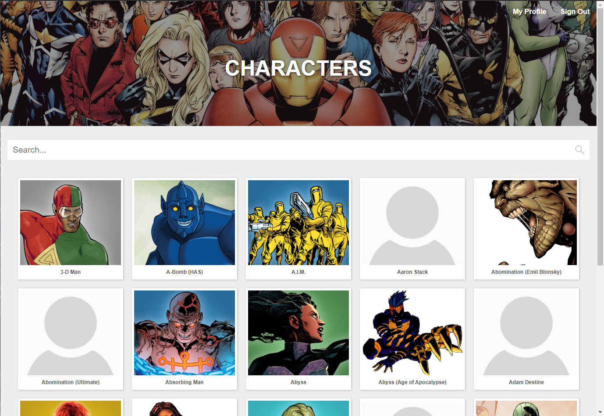
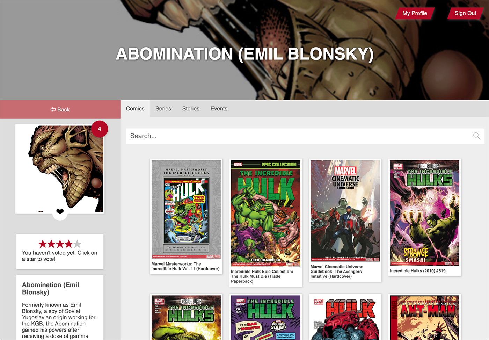
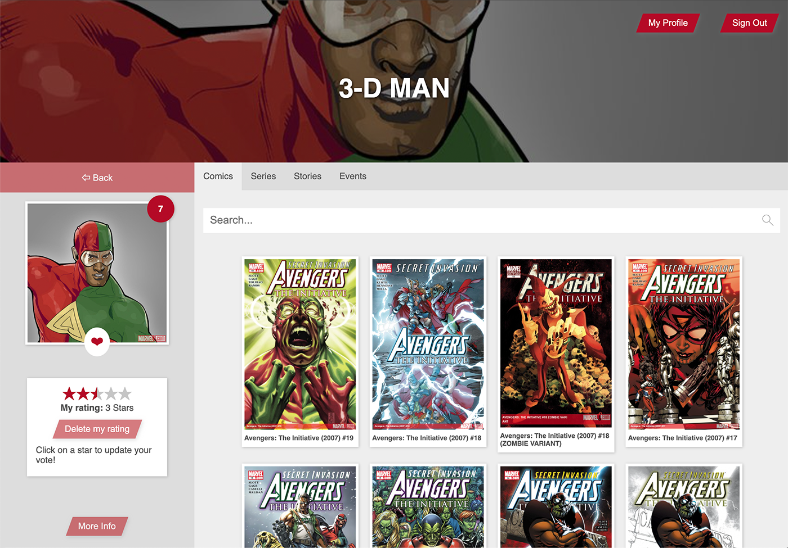

# MarvelApp

This is an educational Angular SPA consuming 2 RESTful APIs: The official Marvel API and a custom made API (Laravel).

This project was originally generated with [Angular CLI](https://github.com/angular/angular-cli) version 8.3.9 and has been updated / upgraded to Angular version 11 including all dependencies (e.g. NgRx).

This Angular App was created during my internship at [Liip](https://www.liip.ch)

---
# Screenshots

*The home screen*

---


*Character detail page while logged in, no ratings and not favorized.*

---


*Character detail page, with ratings and favorized.*

---
# How to run the app

## Git Submodules
Clone the repo, run `git submodule update --init` to initialize the submodules (Frontend and Backend Repositories).

## Add your Marvel API credentials
In order to fetch data from the official Marvel API (https://developer.marvel.com), you'll need to add your own API credentials. Add those credentials to the `environment.ts` file in the frontend repository / directory (marvel-app-frontend/src/environments/environment.ts) or...

...you do the same as i did and add the API credentials to `environment.prod.ts`. I did this out of convenience, until i find a more suitable solution. 

Keep the Backend credentials the way they are, unless you want to set up your own Laravel `ClientId` and `ClientSecret`.


```typescript
export const environment = {
  production: true,

  marvelApiUrl: 'http://gateway.marvel.com/v1/public',

  // Credentials for the Marvel API
  apiPublicKey: 'MyPublicKey',
  timeStamp: 'MyTimestamp',

  // md5(Timestamp + Private Key + Public Key)
  hash: 'MyGeneratedHash',

  apiInitialOffset: 0,
  apiResultLimit: 20,
  apiTypeaheadResultLimit: 5,

  // Backend (Laravel)
  backEndApiUrl: 'http://localhost:8080/api/v1',
  authClientId: 2,
  authClientSecret: 'EWgZb1NOXSYYVOrtaz3b8fpX6vCJBhRKzvdb0L42'
};
```

`timeStamp` is just any random string (refer to the documentation) and the hash is generated via MD5 algorithm.

## Run the App via Docker
You need to build the image first, run `docker-compose build`. Then run `docker-compose up`.
Mind you, this way changes in the source WON'T rebuild on its own!

# Additional information

## Login credentials

You login via the `sign in` button. 2 Accounts are available.

`user: marvel | password: marvel` 

or 

`user: admin | password: admin` 

## TODO's
These items are in no particular order or priority.

- Finish this readme 😅
- ~~Clean up code e.g. get rid of some anti-patterns (E.g. current route via NgRx)~~
- ~~Add inital docker support to run the app~~
- Add a check if the backend is available, and if not, don't show the login header
- ~~Add AuthGuard for the user profile page~~
- ~~Add initial server side rendering and also "dockerize" it~~
- Add a multi stage docker setup: 1. build the application, 2. serve / run the app
- ~~Add a "full-stack" repository so the app including backend can be run with a single `docker-compose up` command.~~
- Find a better solution for the access token as it is currently saved in local storage
- Add Unit tests
- Add E2E tests

## WIP's
- Better AuthGuard implementation 🔐
- Cooler animations for page transitions 😎

## DONT'S
Don't use this app for production! It's for educational / demo purposes only! 
